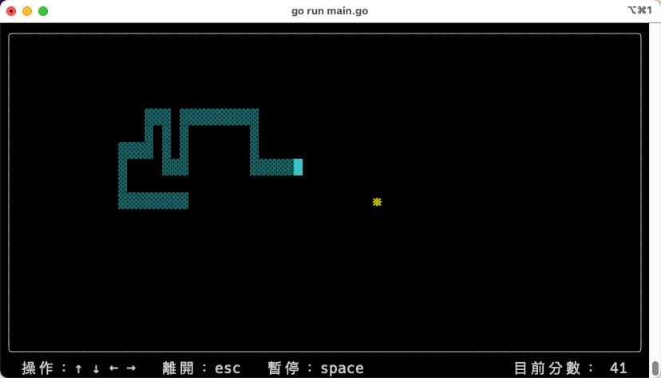

# 歡迎來到 終端機の貪食蛇

🐍 Go 語言製作的終端機貪食蛇

> terminal snake by golang

## 😅 注意！
注意！注意！ 請在 MacOS 環境使用，Windows 目前不支援。

## 說明
* 寫個小遊戲，順便練習練習 Go 語言。
* 將終端機每個位置初始為一個 struct，在藉由 [鏈結串列（Linked list）](https://zh.wikipedia.org/zh-tw/%E9%93%BE%E8%A1%A8) 方式實現 終端機貪食蛇！
* 其實也可以用簡單的 [陣列](https://zh.m.wikipedia.org/zh-tw/%E6%95%B0%E7%BB%84) 方式來簡單實作，但就是故意採用鏈結串列練習回憶指標用法。

* 其他套件分別有：
  * [keyboard](github.com/eiannone/keyboard) － 監聽鍵盤按下的事件
  * [term](golang.org/x/term) － 取得目前終端機的寬高

## 使用
1. 打開終端機，進入專案目錄。
2. 於專案目錄內輸入指令 `./snake` 即可開始遊玩！

## 編譯
1. 打開終端機，進入專案目錄。
2. 於專案目錄內輸入指令 `go run main.go` 即可不用編譯就可以遊玩！
3. 想要重新編譯 `.bin` 檔案的話，可以於專案目錄內執行指令 `go build -o <.bin 名稱>`，例如要輸出 **snake** 的 `.bin`，就執行 `go build -o snake`
